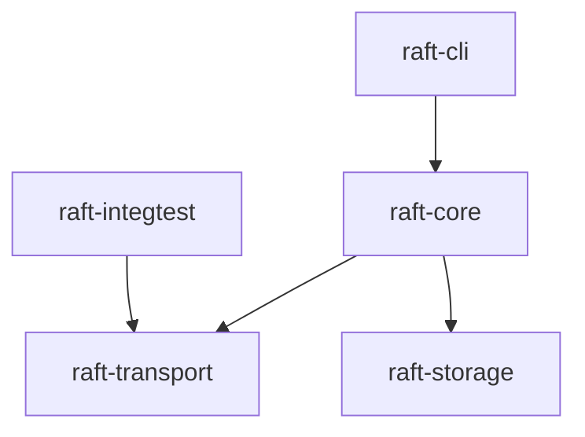
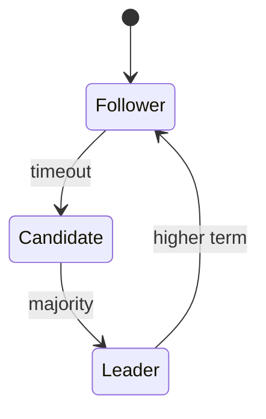

# Distributed Consensus System

Raft in Java 21. Pure algorithm, separate transport, storage, and tooling.





## Get started

```bash
git clone https://github.com/pdj555/distributed-consensus-system.git
cd distributed-consensus-system
mvn clean verify
```

## Overview

```text
raft-core/       Algorithm — no I/O
raft-transport/  Netty + codecs
raft-storage/    Log segments + snapshots
raft-cli/        Admin + stress tools
raft-integtest/  Wire-level tests
```

Netty transport. Memory-mapped log segments. JUnit 5, AssertJ, TestContainers.

Further reading: [docs/design.md](docs/design.md) · [docs/constitution.md](docs/constitution.md) · [docs/adr/](docs/adr/)

## Reference

```bash
mvn test -DskipITs=true
mvn checkstyle:check
mvn spotbugs:check
```

MIT · [LICENSE](LICENSE)
