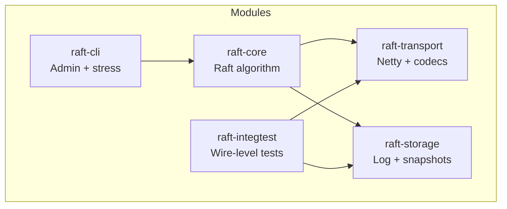
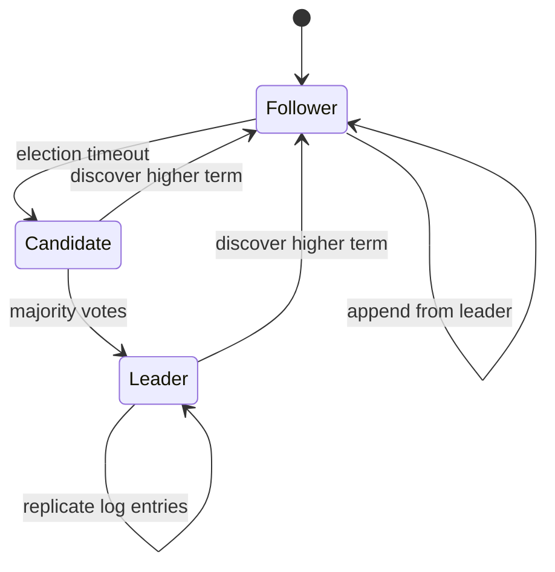

# Distributed Consensus System

Modular Raft implementation in Java 21. The codebase separates pure consensus logic from transport, storage, and operational tooling so each layer can be tested and evolved independently.

## Module architecture



```text
raft-parent/
├── raft-core/       Pure Raft (no I/O)
├── raft-transport/  Netty networking + message codecs
├── raft-storage/    Log segments + snapshot management
├── raft-cli/        Admin tools + stress testing
└── raft-integtest/  End-to-end integration tests
```

## Raft lifecycle



## Technology

| Layer | Choice |
| --- | --- |
| Runtime | JDK 21 LTS |
| Build | Maven 3.9.x |
| Transport | Netty 4 |
| Persistence | Memory-mapped segments + RocksDB snapshots |
| Testing | JUnit 5, AssertJ, jqwik, TestContainers |
| Observability | SLF4J, Logback JSON, Micrometer |

## Quick start

```bash
git clone https://github.com/pdj555/distributed-consensus-system.git
cd distributed-consensus-system

mvn clean verify
mvn test
```

## Quality gates

```bash
mvn checkstyle:check
mvn spotbugs:check
mvn test -DskipITs=true
```

## Documentation

| Document | Contents |
| --- | --- |
| [docs/constitution.md](docs/constitution.md) | Engineering principles |
| [docs/design.md](docs/design.md) | Implementation blueprint |
| [docs/issues.md](docs/issues.md) | Tracked work items |
| [docs/adr/](docs/adr/) | Architecture decision records |

## License

MIT. See [LICENSE](LICENSE).
